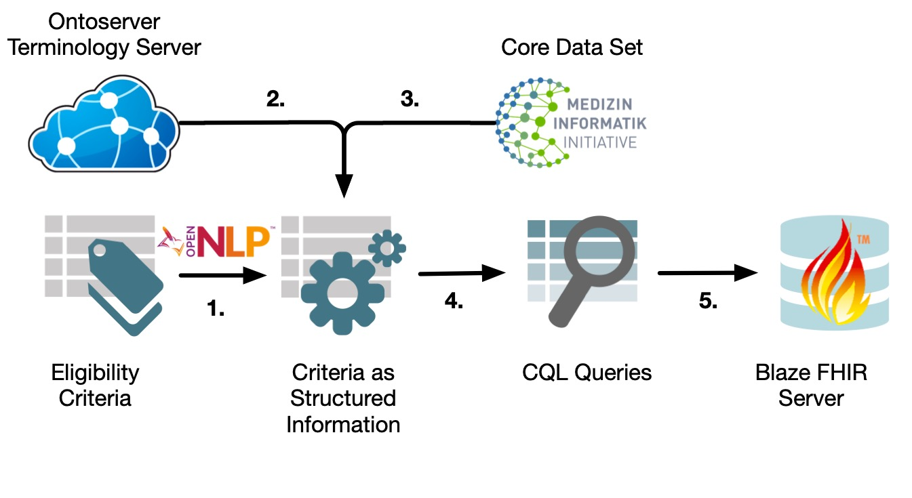

# APERITIF

APERITIF is a fully automatically pipeline transforming information (diagnoses, medication, procedures, laboratory results, patient gender and age) from free-text eligibility criteria of a single study into a CQL query. The query is sent to an instance of the server Blaze to identify the number of eligible patients in the data base of Blaze. 

</img>

After pre-processing of the free-text eligibility criteria by using different natural language processing methods, entity recognition is performed to identify medical concepts such as diagnoses, medications, procedures, or laboratory results. For entity recognition, we used Metamap Lite which is based on UMLS. SNOMED CT and LOINC codes for medical concepts are requested at an instance of the Ontoserver. All extracted data were mapped on relevant data fields of the core data set of the Medical Informatics Initiative (MII) and were transformed into a CQL query which is sent to an instance of the server Blaze. 


## Technical prerequisites
- **Metamap Lite** (see https://metamap.nlm.nih.gov/MetaMapLite.shtml)
- **Blaze** (see https://github.com/samply/blaze)
- **Ontoserver** (see https://ontoserver.csiro.au/docs/6/)
	
	Please add the URL of your Ontoserver to ontoserver.properties!

## Prerequisites for eligibility criteria 
All eligibility criteria have to be written in the English language and separated by enumeration or hyphens:
```
Inclusion criteria:
- criterion A
- criterion B

Exclusion criteria:
- none

```
or 

```
Inclusion criteria:
1. criterion A
2. criterion B

Exclusion criteria:
1. criterion A
2. criterion B

```

## Using APERITIF

### Load data
There are three ways to import study data:

1. For studies registered in ClinicalTrials.gov you can load study data via REST:

```
DataFetcher dataFetcher = new DataFetcher();
NctStudy nctStudyData = dataFetcher.loadDataWithRest("NCTnumber");
```

2. For studies registered in ClinicalTrials.gov you can download the study document as XML file and import it as follows:

```
DataFetcher dataFetcher = new DataFetcher();
NctStudy nctStudyData = dataFetcher.loadFile("yourFilePath");
```

3. For all other studies copy your free-text eligibility criteria into a TXT file and import it as follows:

```
DataFetcher dataFetcher = new DataFetcher();
String studyData = dataFetcher.loadTxtFile("yourFilePath");
```

### Information extraction
For study data acquired by ClinicalTrials.gov there are two ways to process data:

1. NCT-pipeline

Extracting demographic information (age and gender of patients) directly from the corresponding data fields of the study document:

```
NLPnctPipeline nctPipeline = new NLPnctPipeline();
QueryData queryData = nctPipeline.performNCTPipeline(nctStudyData);
```

2. General pipeline

Extracting all information from free-text eligibility criteria

```
NLPgeneralPipeline generalPipeline = new NLPgeneralPipeline();
QueryData queryData = generalPipeline.performGeneralPipeline(nctStudyData.getEligibilityCriterias());
```

For all other studies use 

3. General pipeline

```
NLPgeneralPipeline generalPipeline = new NLPgeneralPipeline();
QueryData queryData = generalPipeline.performGeneralPipeline(studyData);
```


### Create CQL query
Create your CQL query based on the extracted study information:
```
QueryFactory queryFactory = new QueryFactory();
String query = queryFactory.createQuery(queryData);
```


### Write CQL query into TXT file (optionally)
If required a CQL query can be exported into a TXT file (e.g. for modification reasons):
```
FileWriter fileWriter = new FileWriter();
fileWriter.writeTxtFile(query, "yourFilePath");
```
After modification you can import your query:
```
query = dataFetcher.loadTxtFile("yourQueryFilePath"); 
```

### Execute CQL query
Execute your CQL query and print the result:
```
QueryExecutor queryExecutor = new QueryExecutor();
MeasureReport measureReport = queryExecutor.executeQuery(query, "yourBlazeURL");
try{
	int numberOfPatients = measureReport.getGroup().get(0).getPopulation().get(0).getCount();
	System.out.println("number of relevant patients found: " + numberOfPatients);
}catch(Exception e){
	e.printStackTrace();
}
```

## License
This source code is licensed under AGPL-3.0 License
